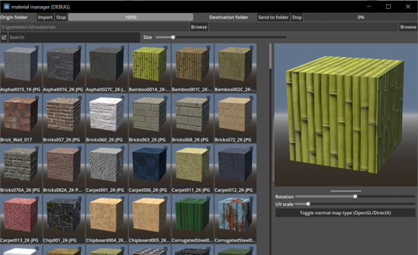

# material-manager
This material manager lets you browse your PBR materials and send chosen materials to specified folder. It can detect texture map types automatically and create material preview images. Made with Godot 4.4.

Workflow:
1. Choose folder with material folders by pressing "Browse" of the left text field. After that press "Import" button to start importing. Each material folder has to have material albedo and maps. Having albedo is required for material to be displayed
2. Tick all materials you would like to move to your 3d related project
3. Choose destination folder by pressing "Browse" of the right text field
4. Press "Send to folder" to copy materials' folders to your choosen folder

Notes:
- Material preview images are stored inside ".preview_images" folder inside your folder with materials. It can be deleted for material rerendering.

