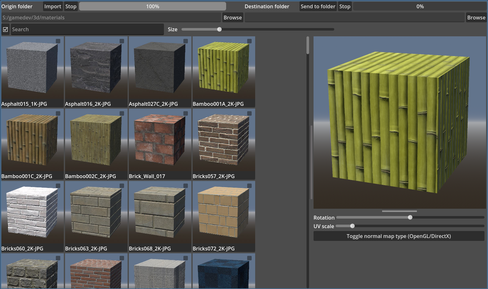

# material-manager
This material manager displays in a list rendered from source images materials and lets you send choosen materials' files to specified folder. Made with godot 4.4.

Workflow:
1. Choose folder with material folders by pressing "Browse" of the left text field. After that press "Import" button to start importing. Each material folder has to have material albedo and maps. Having albedo is required for material to be displaied
2. Tick all materials you would like to move to your 3d related project
3. Choose destination folder by pressing "Browse" of the right text field
4. Press "send to folder" to copy materials' folders to your choosen folder

Notes:
- Material preview images are stored inside ".preview_images" folder inside your folder with materials. It can be deleted for material rerendering.

